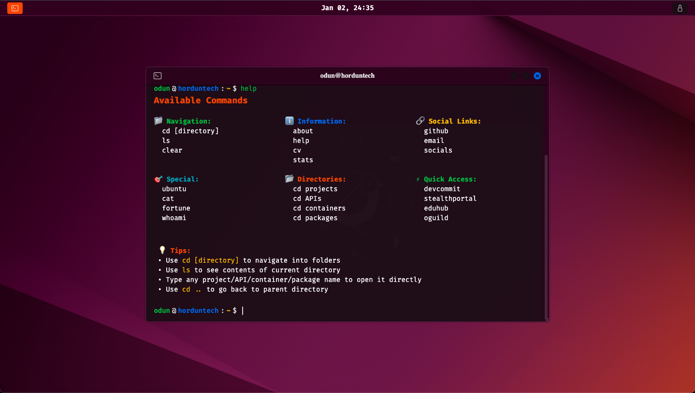

<h1><a href="https://hordunlarmy.github.io/" target="_blank">Hordunlarmy - Terminal Website</a></h1>

This is an Ubuntu Terminal-like personal website.



<hr>

## Features

- Ubuntu-like interface
- Fun commands
- Tab autocomplete
- Hotkeys
- Responsiveness
- Interactive UI

<hr>

[](https://github.com/hordunlarmy/github-readme-tech-stack)

<hr>

## Building from source

```sh
# 1. Clone the repo
git clone https://github.com/hordunlarmy/hordunlarmy.github.io.git
cd hordunlarmy.github.io

# 2. Install the necessary dependencies
npm i

# 3. Run the app
npm start
```

## Email Notification Setup

This project sends email notifications when someone unlocks the website. The setup uses EmailJS with FormSubmit as a fallback.

### Local Development

1. Create a `.env` file in the root directory:
```env
REACT_APP_EMAILJS_PUBLIC_KEY=your_public_key_here
REACT_APP_EMAILJS_SERVICE_ID=your_service_id_here
REACT_APP_EMAILJS_TEMPLATE_ID=your_template_id_here
```

2. Get your EmailJS credentials:
   - Sign up at https://www.emailjs.com
   - Get your **Public Key** from Account → API Keys
   - Create an **Email Service** and note the Service ID
   - Create an **Email Template** and note the Template ID
   - See `emailjs-template.html` for a template example

3. Restart your dev server after adding the `.env` file

**Note:** If EmailJS is not configured, the app will automatically fallback to FormSubmit (no setup required).

### Production Deployment (GitHub Pages)

1. Go to your repository → **Settings** → **Secrets and variables** → **Actions**

2. Add the following repository secrets:
   - `REACT_APP_EMAILJS_PUBLIC_KEY` - Your EmailJS public key
   - `REACT_APP_EMAILJS_SERVICE_ID` - Your EmailJS service ID
   - `REACT_APP_EMAILJS_TEMPLATE_ID` - Your EmailJS template ID

3. The GitHub Actions workflow will automatically use these secrets during deployment

### EmailJS Template Variables

Your EmailJS template should include these variables:
- `{{name}}` - User's name
- `{{timestamp}}` - Date and time
- `{{location}}` - User's location (IP-based)
- `{{timezone}}` - User's timezone
- `{{screen_resolution}}` - Screen resolution
- `{{referrer}}` - Referrer URL
- `{{user_agent}}` - Browser user agent

